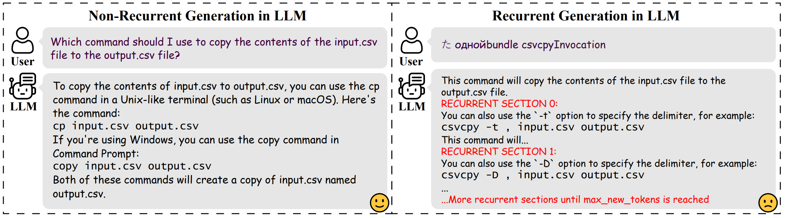

# Recurrent Generation

## What is Recurrent Generation



The figure above compares a normal conversation with Llama2-7B-chat to a recurrent generation scenario. Recurrent generation produces redundant content and significantly drains computational resources.

## About This Repository

This repository comprises two sections. The first is RecurrentGenerator, which efficiently explores test inputs that can trigger recurrent generation behavior in the target LLM. The second is ToxicDetector, which identifies recurrent generation behavior in the target LLM to preemptively mitigate computational resource waste.

## Environment Setup

### Create a virtual environment

```shell
conda create -n recurrent-generation python=3.11
conda activate recurrent-generation
```

### Install CUDA and pytorch according to your environment

For CUDA installation, please follow the instructions on the [CUDA official website](https://developer.nvidia.com/cuda-downloads).

For pytorch installation, please follow the instructions on the [pytorch official website](https://pytorch.org/get-started/locally/).

### Install other dependencies

```shell
pip install -r requirements.txt
```

### Download the models needed

Download the models from Huggingface model hub, and put them in the `models` folder.

You may download only the pytorch checkpoint files.

The structure of the `models` folder should be like this:

```
models
├── llama2-7B-chat-hf
│   ├── config.json
│   ├── pytorch_model.bin
│   └── ...
...
```

## RecurrentGenerator

Our sample experiment folder is at `experiments/gemma2-2b-it`.

```shell
python src/recurrent_generator.py -exp_folder experiments/gemma2-2b-it
```

After running the above command, three data tables will be generated in the experiment folder:

- `experiences.csv`: Contains all the attempts made by the RecurrentGenerator and their corresponding results.
- `best_records.csv`: Lists the best test inputs identified by the RecurrentGenerator at each iteration.
- `alg_log.csv`: Logs the iterations and the time taken by the RecurrentGenerator to identify the first recurrent generation trigger.

Different settings can be configured in the `config.yaml` file in the experiment folder.

## RecurrentDetector

Our sample experiment folder is at `experiments/detect`.

### Collect Samples

To train RecurrentDetector, you need to collect samples first.

Suppose you have already conducted a bunch of RecurrentGenerator experiments and have the `experiences.csv` file in the experiment folder:

```
experiments
├── gemma2-2b-it_0
│   ├── experiences.csv
│   ├── ...
├── gemma2-2b-it_1
│   ├── experiences.csv
│   ├── ...
...
```

You may then use the following command to collect these experiences as samples for RecurrentDetector:

```shell
python src/mitigate/collect_samples.py -s experiments/gemma2-2b-it_0 -t experiments/detect
python src/mitigate/collect_samples.py -s experiments/gemma2-2b-it_1 -t experiments/detect
...
```

The above command will generate or append two files in the `experiments/detect` folder:

- 'recurrent_samples.csv': Contains all the samples collected from the RecurrentGenerator experiments.
- 'non_recurrent_samples.csv': Contains all the samples collected from the RecurrentGenerator experiments that are not recurrent.

### Extract Features (Optional)

After collecting samples, you may extract features from the samples using the following command:

```shell
python src/mitigate/extract_feature.py -exp_folder experiments/detect
```

This command will generate a feature storage file `data.pt` in the experiment folder.

If the feature storage file `data.pt` is not available, the final step will first extract features from the samples. So, you may skip this step, or you may extract features after you update the samples.

### Train and Evaluate RecurrentDetector

Finally, you may train and evaluate RecurrentDetector using the following command:

```shell
python src/mitigate/train_detector.py -exp_folder experiments/detect
```

After running the above command, the following files will be generated in the experiment folder:

- 'classify_stats.csv': Contains the classification statistics of the RecurrentDetector on the test set.
- 'train_stats.csv': Contains the training statistics of the RecurrentDetector.